# §15 Architecture Diagrams

All diagrams in Mermaid. They describe the **target** architecture; where the current implementation differs materially, the difference is noted beneath the diagram.

---

## 15.1 Overall backend architecture

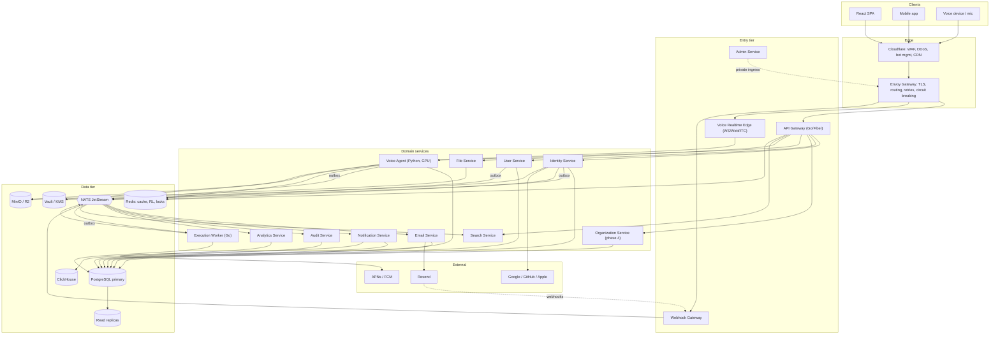

**Today:** the `entry` tier is one process (gateway), there is no `NATS`, no outbox, no Email/Notification/Audit/Analytics/File/Search service, and the agent is reached over unauthenticated plaintext HTTP.

---

## 15.2 Authentication flow

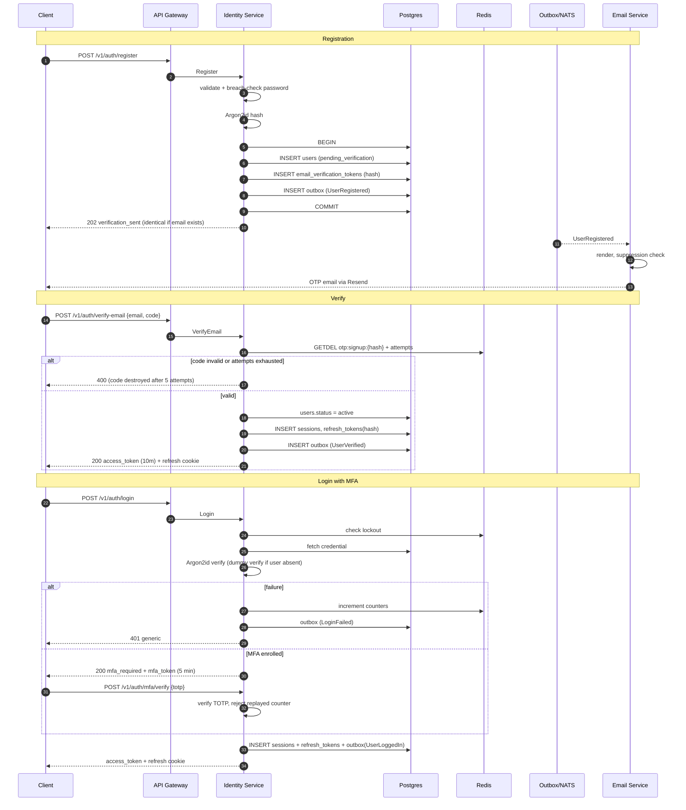

---

## 15.3 Token refresh and reuse detection

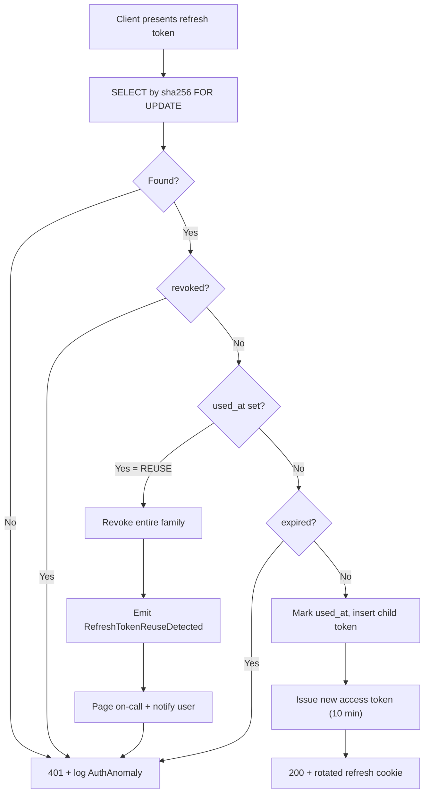

---

## 15.4 Authorization flow

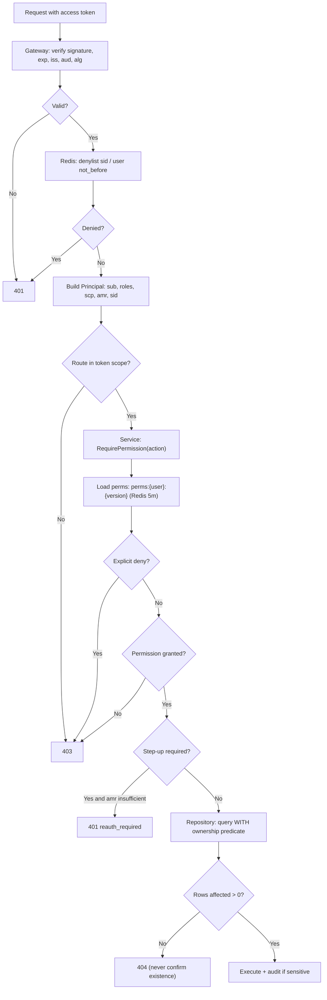

---

## 15.5 API request lifecycle

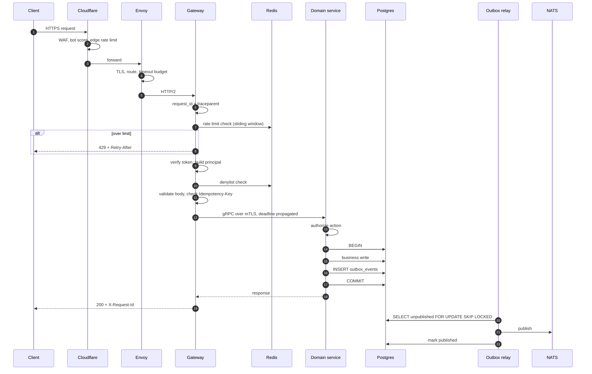

---

## 15.6 Webhook lifecycle

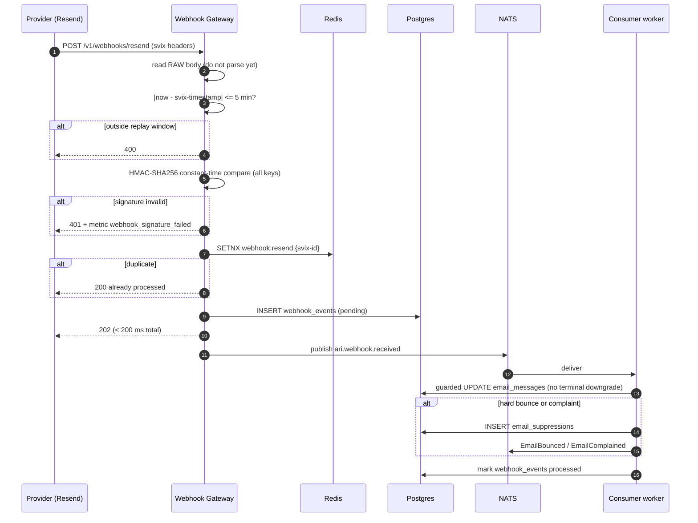

---

## 15.7 Email flow (Resend)

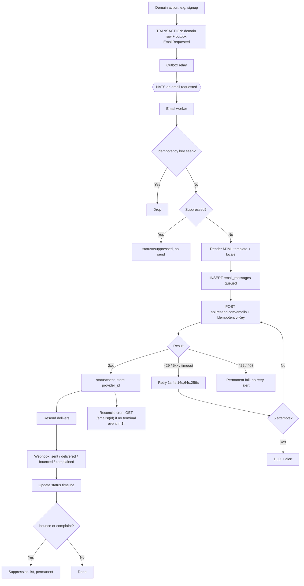

---

## 15.8 Event bus architecture

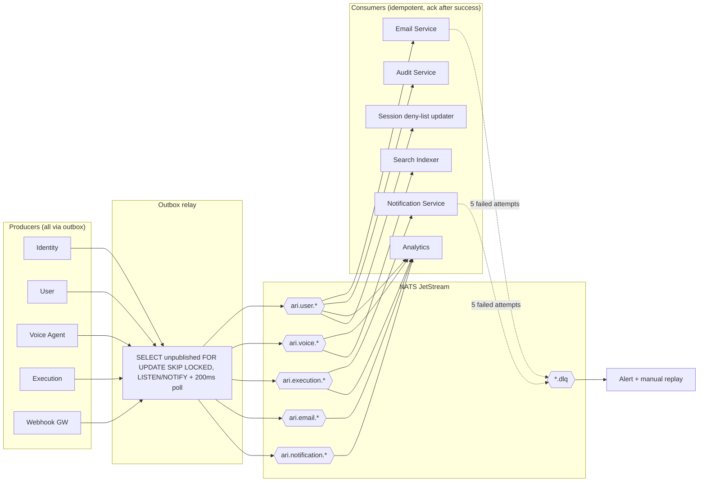

---

## 15.9 Queue processing architecture

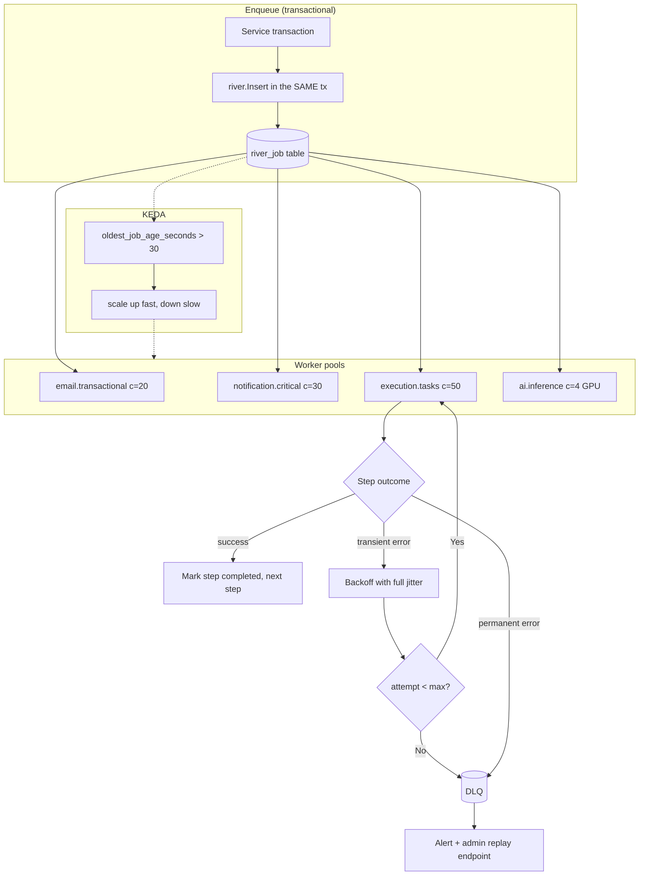

**Today:** `RPush` / `BLPop` on a Redis list — at-most-once, no ack, no retry, no DLQ; a crashed worker silently loses the task.

---

## 15.10 Notification pipeline

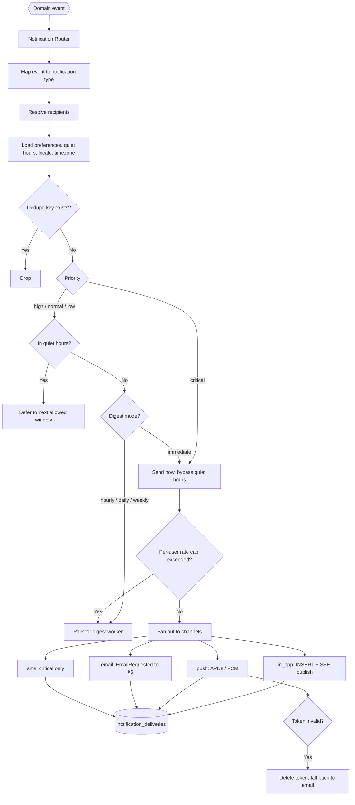

---

## 15.11 Database architecture

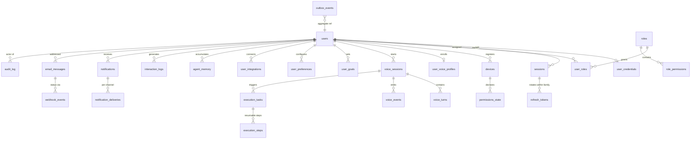

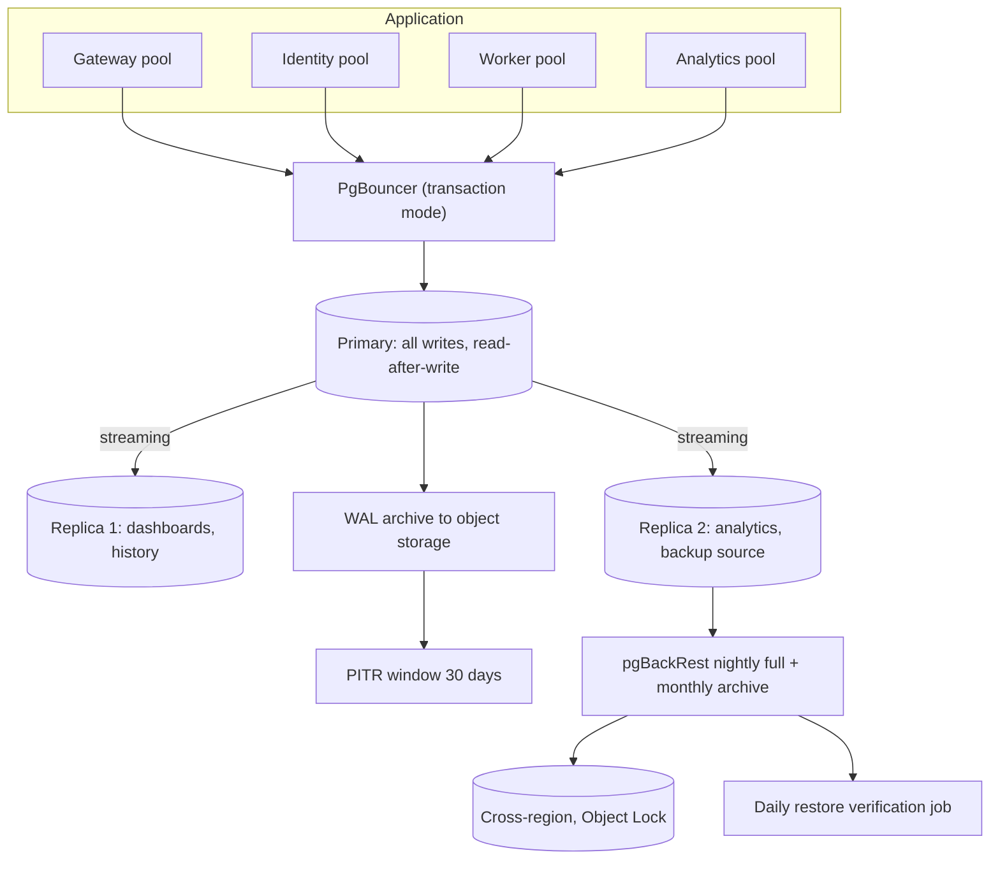

---

## 15.12 Deployment architecture

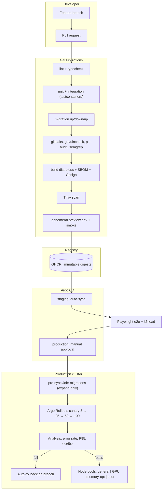

---

## 15.13 Observability stack

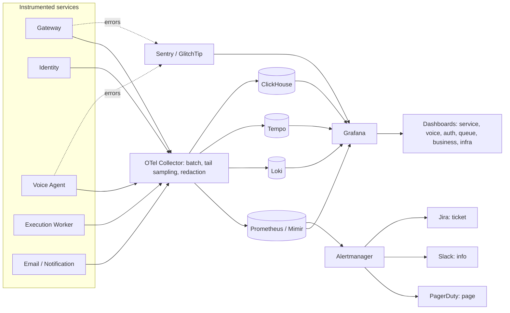

---

## 15.14 Security layers

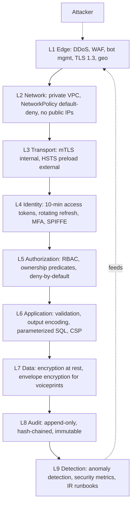

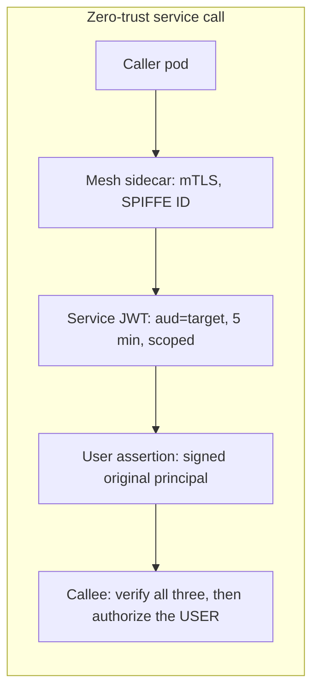

---

## 15.15 Complete end-to-end voice request flow

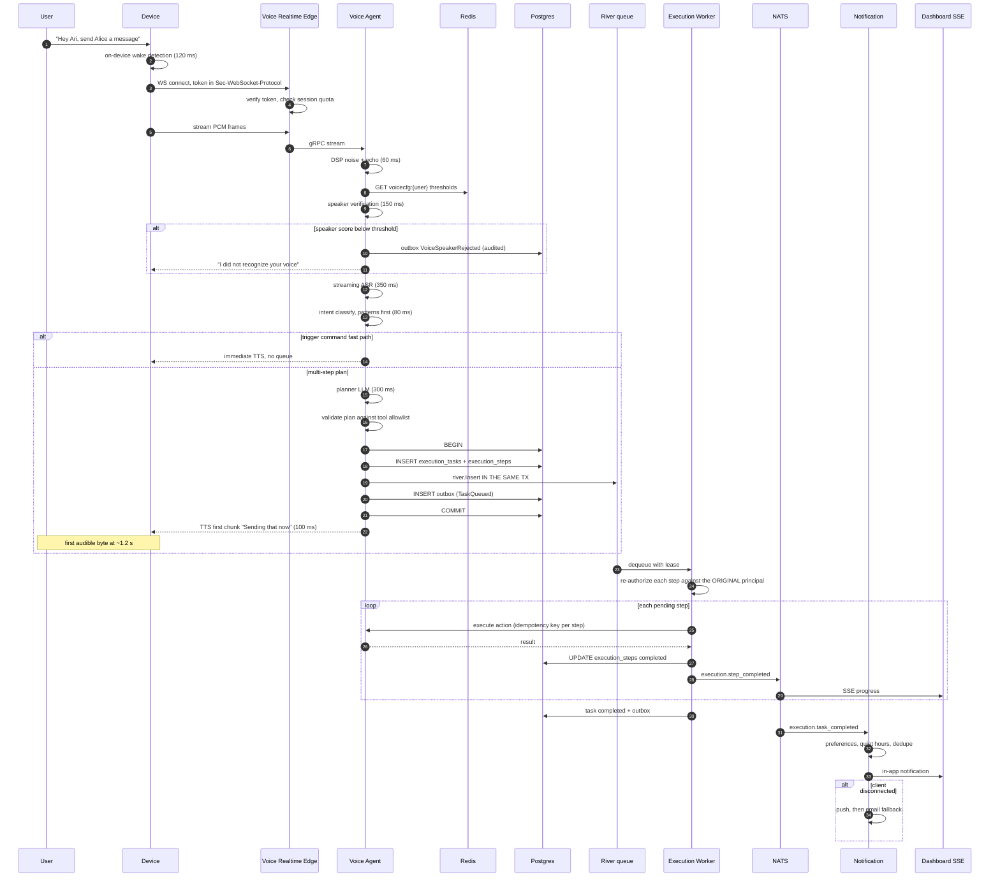
