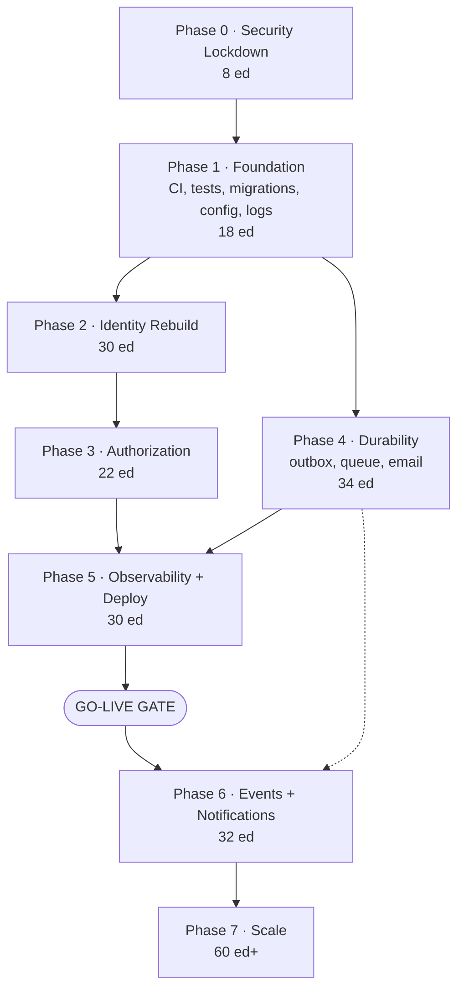
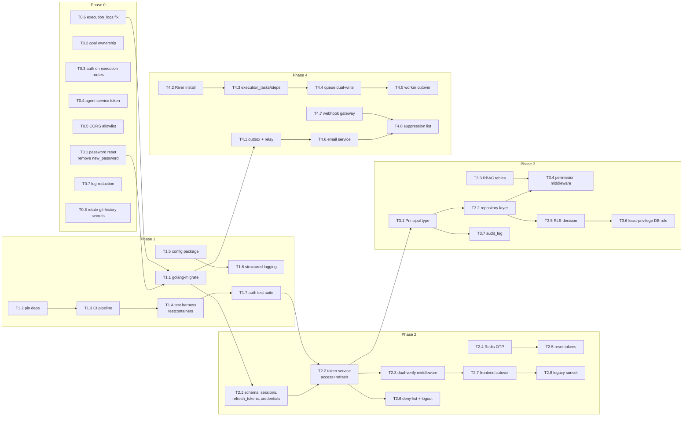
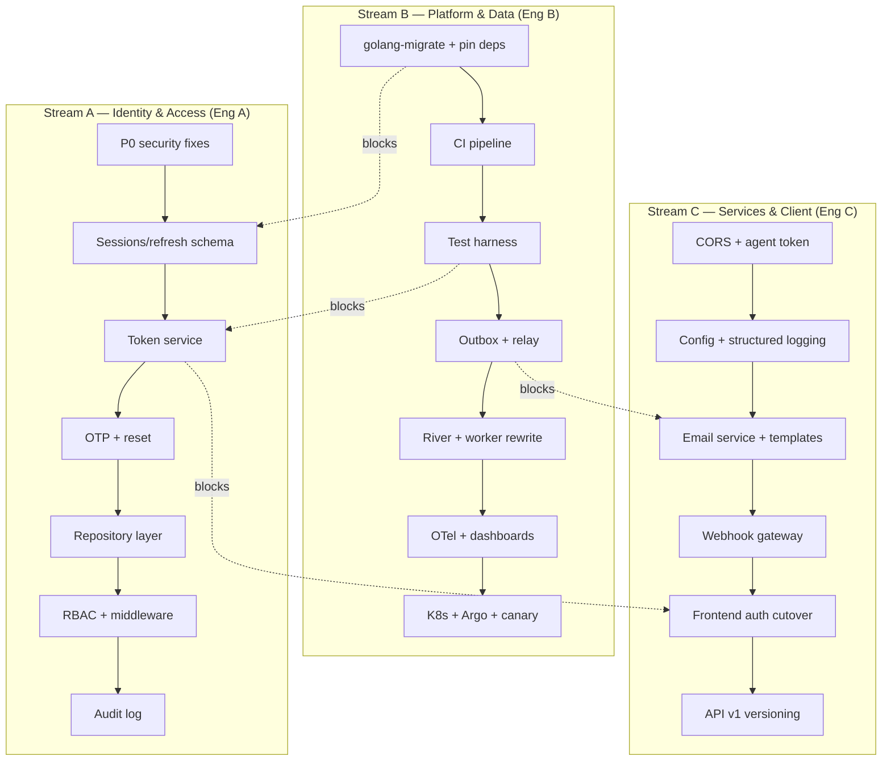

# Dependency Graph & Parallelization

---

## 1. Top-level phase dependencies



### Why each edge exists

| Edge | Reason it cannot be reversed |
|---|---|
| `P0 → P1` | Not strictly technical — it is a policy edge. Every day spent on tooling while `handleForgotPassword` is live is a day of accepted account-takeover risk. P0 is small enough (8 ed) that it does not need the tooling P1 provides. |
| `P1 → P2` | Phase 2 rewrites authentication. With zero tests today, a rewrite without a harness trades a *known* vulnerability for an *unknown* one. P1 also delivers `golang-migrate`; Phase 2 adds five tables and cannot do that safely with the current `run_migrations.go → node run_migrations.js` shim, which has no versioning, no down migrations, and no advisory lock. |
| `P1 → P4` | Same tooling argument. The outbox and queue work is heavily schema-driven. |
| `P2 → P3` | Authorization needs a `Principal` to authorize. Today `c.Locals("userID")` carries a bare string with no roles, scopes, or `amr`. The repository layer's signature (`Delete(ctx, p auth.Principal, id)`) is meaningless until Phase 2 defines `Principal`. Building authz first would mean building it twice. |
| `P3 → P5` | Do not put an under-authorized system on the internet with a public ingress. Phase 5 is the phase that makes ARI genuinely reachable at scale; the access-control model must be settled first. |
| `P4 → P5` | Canary deployments require an SLO to evaluate, and an SLO on a system that silently drops tasks and emails measures the wrong thing. Also: rolling deploys kill workers mid-task, which is *safe* only after River's lease-and-retry lands — with today's `BLPop`, every rollout loses in-flight work. |
| `P5 → GO-LIVE` | You cannot operate what you cannot observe or roll back. |
| `P4 ⇢ P6` (soft) | NATS consumers need the outbox to have something correct to relay. Soft edge: NATS installation and stream config can start during Phase 5. |
| `P6 → P7` | Notifications and the event catalog are prerequisites for the analytics pipeline and the org tier. |

---

## 2. Task-level dependency graph



### Critical path

```
T0.1 → T1.1 → T1.13/T1.14 → T1.17 → T2.1 → T2.2 → T2.3 → T2.7 → T2.8
     → T3.1 → T3.2 → T3.4 → T4.1 → T4.6 → P5 deploy → GO-LIVE
```

Anything not on this chain is float and should be scheduled to keep the critical-path engineer unblocked. The two longest-pole items are **T2.2 (token service, 8 ed)** and **T3.2 (repository layer, 9 ed)** — start their design reviews one sprint early.

---

## 3. Parallel work streams

Three streams that share almost no files and can run concurrently from Sprint 2 onward:



**Synchronization points** — the only four places the streams must meet:

| Sync | When | What must be agreed |
|---|---|---|
| **SP1** | End of Sprint 2 | Migration tooling and naming convention; everyone writes migrations the same way from here |
| **SP2** | Sprint 4 | The `Principal` struct and `auth.Context` shape — A, B, and C all consume it |
| **SP3** | Sprint 6 | Auth cutover: backend must accept both token types before the frontend switches, and the frontend must be switched before legacy sunset |
| **SP4** | Sprint 11 | Event envelope and outbox row shape — email, notifications, and audit all consume it |

### What must NOT be parallelized

| Do not overlap | Why |
|---|---|
| Token service (T2.2) and repository layer (T3.2) | Both change the request-context shape. Concurrent edits to middleware produce merge conflicts in the highest-risk file in the codebase. |
| Queue cutover (T4.5) and worker feature work | The cutover needs a stable worker to compare old vs. new behaviour against. |
| Schema expand and code that reads the new columns | Separate PRs, separate deploys — this is the entire point of expand/contract. |
| RLS decision (T3.5) and DB role change (T3.6) | T3.6 removes `BYPASSRLS`; if T3.5 chose "keep RLS" and the GUC plumbing is not finished, every query starts failing. |
| Two migrations touching the same table | `golang-migrate` serializes, but a failed second migration on a partially-migrated table is the hardest rollback there is. |

---

## 4. Cross-cutting prerequisite chains

**Chain 1 — Nothing can be verified without a test harness.**
`pin deps → reproducible build → testcontainers Postgres+Redis → integration tests → confidence to rewrite auth`
Breaking this chain is what makes an "urgent" auth fix take three weeks of firefighting instead of three days.

**Chain 2 — Nothing can be rolled back without versioned migrations.**
`golang-migrate → down migrations tested in CI → expand/contract discipline → zero-downtime schema change`
The `execution_logs` defect (code references three columns the schema lacks) is the direct product of this chain's absence.

**Chain 3 — Nothing can be authorized without an authenticated principal.**
`Principal type → repository signatures → ownership predicates → RBAC → admin surface`

**Chain 4 — Nothing is durable without the outbox.**
`outbox table → relay → River jobs enqueued in-transaction → email/notification consumers → event bus`

**Chain 5 — Nothing can be deployed safely without observability.**
`structured logs → metrics → traces → SLOs → canary analysis → automated rollback`

---

## 5. Fastest-path variant (if timeline is the binding constraint)

If the goal is "smallest thing safely exposable to real users," this subset is the honest minimum. It reaches ~78% readiness rather than 85%, and knowingly defers the rest.

| Include | Defer |
|---|---|
| All of Phase 0 | Notifications (P6) |
| Phase 1 (all — non-negotiable) | MFA/OAuth (P6) |
| Phase 2 (all) | NATS event bus (P6) — outbox alone is enough at low volume |
| Phase 3 tasks T3.1, T3.2, T3.5, T3.6 | RBAC roles table (T3.3/T3.4) — single `user` role is fine pre-orgs |
| Phase 4 tasks T4.1–T4.6 | Agent split (P6), File/Search services (P7) |
| Phase 5 (all — non-negotiable) | Partitioning, replicas, ClickHouse (P7) |

**≈118 ed → 24 weeks solo / 11 weeks with three engineers.** Phases 1 and 5 appear in the "non-negotiable" column deliberately: they are the two phases most often cut under schedule pressure, and they are the two that make everything after them recoverable.
