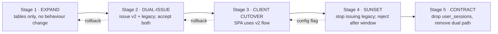

# Authentication & Authorization Migration

---

# Part 1 — Authentication cutover

## 1.1 The compatibility problem

The current system issues an HS256 JWT with `{sub, iat, exp}` and a **30-day** lifetime, stores a copy in `user_sessions.token`, and validates signature-only. Any outstanding token is therefore valid for up to 30 days after the last issuance, and the server has no way to invalidate it.

That single fact dictates the entire cutover shape: **the legacy acceptance window must be at least as long as the maximum remaining lifetime of any issued legacy token**, or users are logged out mid-session. If you shorten the window, you must accept forced re-authentication.

> `[SKIP-IF-GREENFIELD]` With no live users, skip stages 2 and 5 entirely, issue v2 tokens from day one, and drop `user_sessions` immediately. Saves ~4.5 ed and three weeks of calendar time.

## 1.2 Five-stage cutover



### Stage 1 — Expand (deploy 1)

Migrations M011–M014. No code reads the new tables. Fully reversible, zero user impact. Verify the tables exist and the backfill populated `user_credentials` for 100% of users with a non-empty `password_hash`.

### Stage 2 — Dual-issue (deploy 2)

Login and OTP-verify now do both:

```go
// New primary
access, refresh, sess := identity.IssueSession(ctx, user, deviceInfo, ip)
c.Cookie(&fiber.Cookie{
    Name: "__Host-ari_rt", Value: refresh, HTTPOnly: true, Secure: true,
    SameSite: "Strict", Path: "/api/auth/refresh", MaxAge: 30*24*3600,
})
// Legacy, retained so old clients keep working  [SKIP-IF-GREENFIELD]
legacy, _ := GenerateJWT(user.ID)
DB.Exec(ctx, "INSERT INTO user_sessions (user_id, token, device_info, expires_at) …")

return c.JSON(fiber.Map{
    "status":       "success",
    "access_token": access, "expires_in": 600,   // new clients
    "token":        legacy,                      // old clients
    "user":         userPayload,
})
```

Middleware becomes dual-verify, and the order matters — try v2 first so the common path stays cheap:

```go
func AuthRequired() fiber.Handler {
  return func(c *fiber.Ctx) error {
    raw := bearer(c)
    if p, err := identity.VerifyAccessToken(raw); err == nil {
        if identity.IsDenied(c.Context(), p.SessionID, p.UserID, p.IssuedAt) {
            return unauthorized(c, "session_revoked")
        }
        metrics.TokenType.WithLabelValues("v2").Inc()
        c.Locals("principal", p); c.Locals("userID", p.UserID)  // keep for compat
        return c.Next()
    }
    // Legacy path  [SKIP-IF-GREENFIELD]
    if !cfg.AcceptLegacyTokens { return unauthorized(c, "invalid_token") }
    userID, err := ValidateJWT(raw)
    if err != nil { return unauthorized(c, "invalid_token") }
    var ok bool
    DB.QueryRow(c.Context(),
      `SELECT EXISTS(SELECT 1 FROM user_sessions
                     WHERE token=$1 AND user_id=$2 AND expires_at > NOW())`,
      raw, userID).Scan(&ok)
    if !ok { return unauthorized(c, "session_expired") }   // legacy now revocable too
    metrics.TokenType.WithLabelValues("legacy").Inc()
    c.Locals("principal", identity.LegacyPrincipal(userID)); c.Locals("userID", userID)
    return c.Next()
  }
}
```

Two things worth noting. First, `c.Locals("userID")` is preserved so no handler needs to change in this deploy — handlers migrate to `principal` during Phase 3. Second, the legacy branch now checks `user_sessions`, which means **revocation starts working for legacy tokens too** during the transition. That costs one indexed query per legacy request and is worth it: without it, `logout-all` remains a lie for anyone still on an old token.

`cfg.AcceptLegacyTokens` is the rollback switch for Stage 4.

### Stage 3 — Client cutover (deploy 3, frontend)

`frontend/src/api/client.ts` and `frontend/src/app/context/AuthContext.tsx` currently disagree — they use `ari_token` and `ari_auth_token` respectively. Unify on a single in-memory token held in the API client, with no `localStorage` at all.

```ts
let accessToken: string | null = null;
let refreshInFlight: Promise<string> | null = null;

async function refresh(): Promise<string> {
  // Single-flight: N concurrent 401s must produce exactly ONE refresh call,
  // or the rotation reuse-detector revokes the family and logs the user out.
  refreshInFlight ??= fetch("/api/auth/refresh", { method: "POST", credentials: "include" })
    .then(r => { if (!r.ok) throw new Error("refresh_failed"); return r.json(); })
    .then(d => { accessToken = d.access_token; return d.access_token; })
    .finally(() => { refreshInFlight = null; });
  return refreshInFlight;
}
```

On app load there is no token in storage, so the client calls `/api/auth/refresh` once; the `HttpOnly` cookie either restores the session or it does not. This replaces `/api/auth/auto-signin` and is strictly better, because the credential is never exposed to JavaScript.

The single-flight guard is the highest-risk detail in the entire client migration. Test it explicitly with ten simultaneous requests against an expired access token.

### Stage 4 — Sunset (deploy 4, config change)

Preconditions, all required:
- `auth_token_type{type="legacy"}` below 1% of requests for 7 consecutive days.
- ≥30 days since Stage 2 (the legacy token lifetime).
- Users notified via email and an in-app banner.

Then flip `ACCEPT_LEGACY_TOKENS=false`. Keep the flag for one release so a bad outcome is a config revert, not a redeploy.

### Stage 5 — Contract (deploy 5)

Migration M015: `DROP TABLE user_sessions`, `ALTER TABLE users DROP COLUMN password_hash`. Remove the legacy branch from the middleware and `GenerateJWT`. Take a verified backup first — this is the one irreversible step.

## 1.3 Per-feature migration detail

| Feature | Today | Target | Migration approach |
|---|---|---|---|
| **JWT** | HS256, shared secret, 30 d, `{sub,iat,exp}` | EdDSA, 10 min, `{sub,sid,jti,aud,iss,scp,roles,amr}` | New `kid`-tagged tokens alongside legacy; verifier tries v2 then legacy |
| **Refresh tokens** | None | Opaque 32 B, SHA-256 at rest, rotating, reuse-detecting | New capability — nothing to migrate |
| **Sessions** | `user_sessions` row holding the raw JWT | `sessions` + `refresh_tokens`, token never stored | Dual-write in Stage 2; legacy table read-only in Stage 4; dropped in Stage 5 |
| **Password reset** | Already fixed in Phase 0 (T0.1) | Unchanged | — |
| **Email verification** | In-memory `sync.Map` + plain OTP compare | Redis hashed OTP + `email_verification_tokens`, 5-attempt cap | Cutover in one deploy: drain by accepting both stores for 15 min (the OTP TTL), then remove the map |
| **MFA** | None | TOTP + recovery codes, `amr`-gated step-up | Additive (Phase 6). Enrollment is opt-in; enforcement for admins only, initially |
| **OAuth** | Env vars only, no code | Google/GitHub/Apple + PKCE | Additive (Phase 6). Link only to `email_verified` provider accounts; never auto-link to an existing password account |
| **Device management** | `devices` table, unused by auth | `device_id` in the token, trust flags, per-device revoke | Additive; devices register on first use |
| **Token revocation** | Non-existent (middleware never checks) | Redis deny-list by `sid` and by user `not_before` | Live from Stage 2 for v2; legacy gains DB-checked revocation in the same stage |
| **Logout** | No endpoint at all | `/logout` (this session), `/logout-all` (all) | New endpoints in Stage 2 |
| **Session revocation** | `handleRevokeSession` deletes rows nobody reads | Revokes session + refresh family + deny-list entry | Same endpoint, real implementation |

## 1.4 OTP cutover detail

The riskiest small change, because a mistake means nobody can sign up.

```
Deploy A: write to BOTH sync.Map and Redis; read from sync.Map first, then Redis
Deploy B (≥15 min later, > OTP TTL): read from Redis first, then sync.Map
Deploy C (next release): Redis only; delete pendingSignups entirely
```

Fifteen minutes covers the 10-minute OTP TTL plus margin. In practice with a single replica you could do this in one deploy; the staged version costs almost nothing and removes the failure mode where a user who requested a code 30 seconds before the deploy cannot verify.

New Redis structure and the atomic consume (a Lua script, so check-and-delete cannot race):

```lua
-- KEYS[1] = otp:signup:{email_hash}, ARGV[1] = sha256(code+pepper)
local v = redis.call('HMGET', KEYS[1], 'hash', 'attempts')
if not v[1] then return {err='not_found'} end
if tonumber(v[2]) >= 5 then redis.call('DEL', KEYS[1]); return {err='too_many'} end
if v[1] ~= ARGV[1] then redis.call('HINCRBY', KEYS[1], 'attempts', 1); return {err='mismatch'} end
redis.call('DEL', KEYS[1]); return 1
```

Note the comparison happens inside Redis on hashes, so the timing-attack surface of the current `pending.OTP != req.Code` disappears; the Go-side comparison that remains (for the pepper) uses `subtle.ConstantTimeCompare`.

## 1.5 Auth rollback matrix

| Stage | Failure symptom | Rollback | Time |
|---|---|---|---|
| 1 | None possible | `migrate down 1` | 2 min |
| 2 | v2 issuance broken | Revert deploy; legacy still issued and accepted | 5 min |
| 3 | Client cannot refresh | Revert SPA bundle; backend still dual-accepts | 2 min |
| 4 | Users unexpectedly logged out | `ACCEPT_LEGACY_TOKENS=true` | 1 min |
| 5 | Something still read the dropped table | PITR restore | 1 h |

---

# Part 2 — Authorization migration

## 2.1 Current handlers → repository layer

Today every handler builds SQL inline against a package-level `DB`. The migration replaces that with repositories that cannot be called without a principal.

**Before** (`user_handlers.go`):
```go
func handleDeleteGoal(c *fiber.Ctx) error {
    goalID := c.Params("id")
    _, err := DB.Exec(ctx, "DELETE FROM user_goals WHERE id=$1", goalID)  // no owner check
    ...
}
```

**After:**
```go
func (h *GoalHandler) Delete(c *fiber.Ctx) error {
    p := authz.PrincipalFrom(c)                        // panics if middleware absent
    id, err := uuid.Parse(c.Params("id"))
    if err != nil { return problem.BadRequest(c, "invalid_id") }
    if err := h.goals.Delete(c.Context(), p, id); err != nil {
        return problem.From(c, err)                    // ErrNotFound → 404
    }
    return c.SendStatus(fiber.StatusNoContent)
}
```

The repository is where the invariant lives:
```go
func (r *GoalRepo) Delete(ctx context.Context, p authz.Principal, id uuid.UUID) error {
    tag, err := r.db.Exec(ctx,
        `DELETE FROM user_goals WHERE id = $1 AND user_id = $2`, id, p.UserID)
    if err != nil { return fmt.Errorf("delete goal: %w", err) }
    if tag.RowsAffected() == 0 { return ErrNotFound }
    return nil
}
```

Because `p authz.Principal` is a required parameter, a developer cannot write an unscoped query without deliberately ignoring an argument — which review and the CI lint will catch.

## 2.2 Migration order (one resource per PR)

| PR | Resource | Handlers | Risk | Notes |
|---|---|---|---|---|
| 1 | Goals | 4 | Low | Contains the known BOLA; do first, establishes the pattern |
| 2 | Preferences | 2 | Low | Already scoped; mechanical |
| 3 | Integrations | 2 | Low | Fix the read-then-write race while here |
| 4 | Profile | 2 | Medium | Add optimistic locking via `version` |
| 5 | Voice/biometrics | 2 | **High** | Add mandatory audit on every voiceprint read/write |
| 6 | Sessions | 2 | Medium | Depends on Phase 2 tables |
| 7 | Auth/identity | ~6 | **High** | Last, and only after 1–6 are stable |

Each PR: move handlers, add the resource's authz matrix tests, leave everything else untouched. Never a big-bang refactor — the whole value of this ordering is that a regression is scoped to one resource.

## 2.3 Permission middleware rollout

Applied at the **router group**, so new routes are protected by default rather than by remembering:

```go
api := app.Group("/api/v1", AuthRequired())

goals := api.Group("/goals", authz.Require("goal:read:own"))
goals.Get("/",        h.Goals.List)
goals.Post("/",       authz.Require("goal:write:own"), h.Goals.Create)
goals.Patch("/:id",   authz.Require("goal:write:own"), h.Goals.Update)
goals.Delete("/:id",  authz.Require("goal:delete:own"), h.Goals.Delete)

admin := app.Group("/internal/admin", AuthRequired(),
                   authz.Require("admin:access"), authz.RequireStepUp(5*time.Minute))
```

**Rollout in shadow mode first.** For one week, `authz.Require` logs what it *would* have denied without actually denying:

```go
if !allowed {
    metrics.AuthzShadowDeny.WithLabelValues(permission, route).Inc()
    if cfg.AuthzEnforce { return problem.Forbidden(c, permission) }
    log.Warn("authz shadow deny", "perm", permission, "user", p.UserID, "route", route)
}
```

Then read the metric. A non-zero shadow-deny rate on a legitimate route means the permission mapping is wrong — far better to learn that from a dashboard than from users. Flip `AUTHZ_ENFORCE=true` only when shadow denials are zero for legitimate traffic.

## 2.4 RBAC bootstrapping

Seed roles in M016; backfill `user_roles` from `users.role` with `lower()` normalization (the current default is `'User'`). Permission sets:

```
user:        goal:*:own, preference:*:own, integration:*:own, voice_profile:*:own,
             voice_session:invoke:own, execution_task:*:own, session:read:own,
             session:revoke:own, notification:*:own
support:     user:read (metadata only — never content, never biometrics), audit:read
admin:       support + user:write, user:suspend, feature_flag:write, admin:access
super_admin: admin + role:grant, admin:impersonate, key:rotate
```

Note what `support` deliberately excludes: `interaction_logs` content and anything touching `user_voice_profiles`. Support staff reading transcripts of users' speech is a privacy incident waiting to be normalized.

## 2.5 Ownership vs. RBAC — the division

RBAC answers "may this *kind* of user do this *kind* of thing." Ownership answers "is this *specific* object theirs." Both are required, and neither substitutes for the other — a `user` role holder legitimately has `goal:delete:own`, and that is precisely the permission that must not let them delete someone else's goal.

Enforcement points: RBAC in middleware (cheap, before any DB work), ownership in the repository (correct, because it is expressed as a WHERE clause that cannot be forgotten).

## 2.6 Database permissions migration

The riskiest infrastructure change in Phase 3, because failures appear only on unexercised code paths.

1. Create `ari_app` with explicit grants (M018).
2. Run `scripts/verify_grants.sql` in CI against the test container on every PR — it asserts `ari_app` can perform every operation the app performs.
3. Point **staging** at `ari_app` for a full sprint; watch for `permission denied` in logs.
4. Point production at `ari_app` during a low-traffic window; keep the old role live.
5. Remove the old role one release later.

## 2.7 Authorization testing strategy

The **authz matrix** is the deliverable, not an afterthought. Table-driven, ~150 cases:

```go
cases := []struct{ role, action, ownership string; want int }{
    {"user",  "goal:read",   "own",         200},
    {"user",  "goal:read",   "other",       404},   // NOT 403 — no existence oracle
    {"user",  "goal:delete", "other",       404},
    {"user",  "goal:delete", "nonexistent", 404},   // indistinguishable from "other"
    {"user",  "admin:access","-",           403},
    {"support","user:read",  "other",       200},
    {"support","user:write", "other",       403},
    {"support","voice_profile:read","other",403},   // support must never reach biometrics
    {"admin", "user:suspend","other",       200},
    {"anon",  "goal:read",   "own",         401},
    // … × every resource
}
```

Three properties this suite must have: (1) it runs on every PR, (2) a *new resource without matrix entries fails the build*, and (3) the "other user's object" cases are present for every single resource — those are the ones that catch the BOLA class.

Additional required tests: audit rows written on every denial; deny-by-default proven by adding an unregistered route in a test and asserting 403; step-up enforcement on sensitive actions; the CI lint that fails on any `DB.Exec`/`DB.Query` outside `repository/`.

## 2.8 Admin and organization permissions

**Admin** ships in Phase 6 as a separate deployment behind private ingress, SSO, and mandatory WebAuthn. Impersonation issues a token with an `act` claim naming the admin, expires in 30 minutes, appears in the impersonated user's session list, and is barred from biometric endpoints by an explicit deny rule — deny beats allow, so no role grant can accidentally re-enable it.

**Organization permissions** are Phase 7. The schema is designed now (`user_roles.scope_type`/`scope_id` already accommodate org and team scopes) precisely so that adding orgs later is an insert, not a migration of every permission check.
